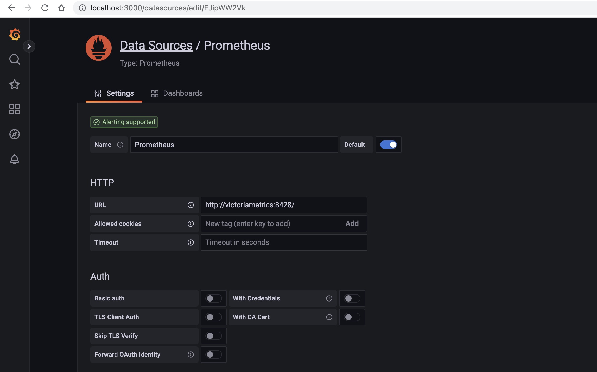
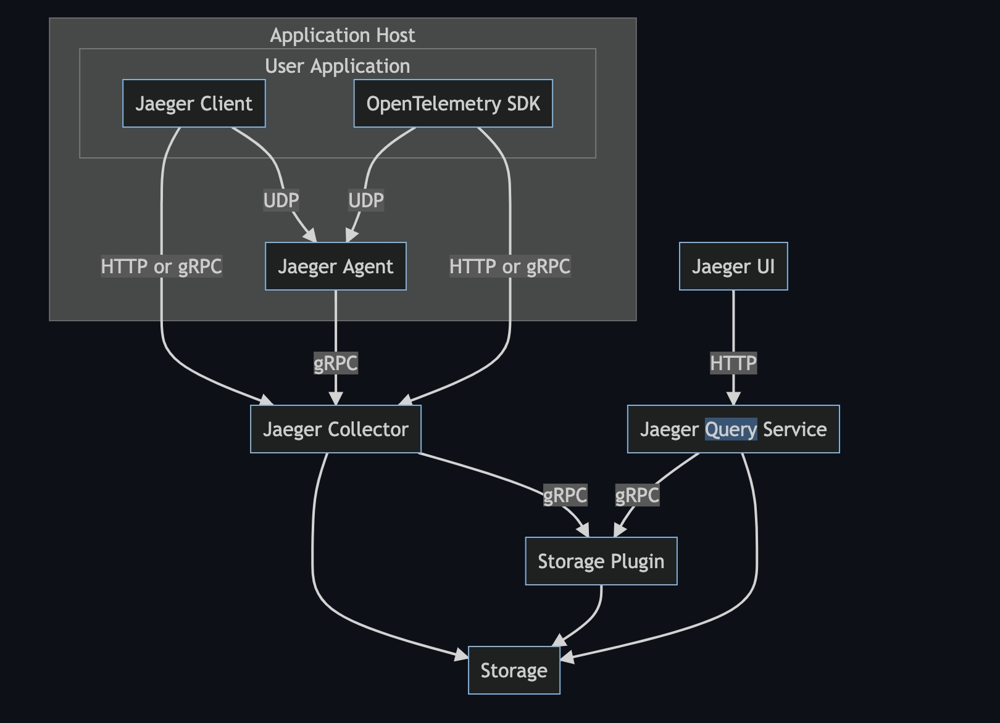

# Opentelemetry Example

## HOW-TO-RUN
1. install docker
2. run opentelemetry-collector、jaeger、victoriametrics、grafana: `docker-compose up -d`
4. run Kitex server: `go run server/main.go`
5. run Kitex client: `go run client/main.go`

## MONITORING

## View Trace
You can then navigate to http://localhost:16686 to access the Jaeger UI. (You can visit Monitor Jaeger for details)


## View Metrics
You can then navigate to http://localhost:3000 to access the Grafana UI. (You can visit Monitor Grafana for metrics)

### add datasource

URL: `http://victoriametrics:8428/`


### add a dashboard and a panel

### support metrics 
- RPC Metrics
- Runtime Metrics

## Tracing associated Logs

#### set logger impl
```go
import (
    kitexlogrus "github.com/kitex-contrib/obs-opentelemetry/logging/logrus"
)

func init()  {
    klog.SetLogger(kitexlogrus.NewLogger())
    klog.SetLevel(klog.LevelDebug)

}
```

#### log with context

```go
// Echo implements the Echo interface.
func (s *EchoImpl) Echo(ctx context.Context, req *api.Request) (resp *api.Response, err error) {
	klog.CtxDebugf(ctx, "echo called: %s", req.GetMessage())
	return &api.Response{Message: req.Message}, nil
}
```

#### view log

```log
{"level":"debug","msg":"echo called: my request","span_id":"056e0cf9a8b2cec3","time":"2022-03-09T02:47:28+08:00","trace_flags":"01","trace_id":"33bdd3c81c9eb6cbc0fbb59c57ce088b"}
```

# Work with Jaeger
> [Introducing native support for OpenTelemetry in Jaeger](https://medium.com/jaegertracing/introducing-native-support-for-opentelemetry-in-jaeger-eb661be8183c)

Jaeger natively supports OTLP protocol, and we can send data directly to Jaeger without OpenTelemetry Collector

### Jaeger Architecture 
> Image from [jaeger](https://github.com/jaegertracing/jaeger)



### Demo

#### Run Jaeger with COLLECTOR_OTLP_ENABLED
```yaml
version: "3.7"
services:
  # Jaeger
  jaeger-all-in-one:
    image: jaegertracing/all-in-one:latest
    environment:
      - COLLECTOR_OTLP_ENABLED=true
    ports:
      - "4317:4317"   # OTLP gRPC receiver
```

#### Config Exporter with Environment
```yaml
export OTEL_EXPORTER_OTLP_ENDPOINT=http://host.docker.internal:4317
export OTEL_EXPORTER_OTLP_PROTOCOL=grpc
```

### Run Exeample App and View Jaeger


